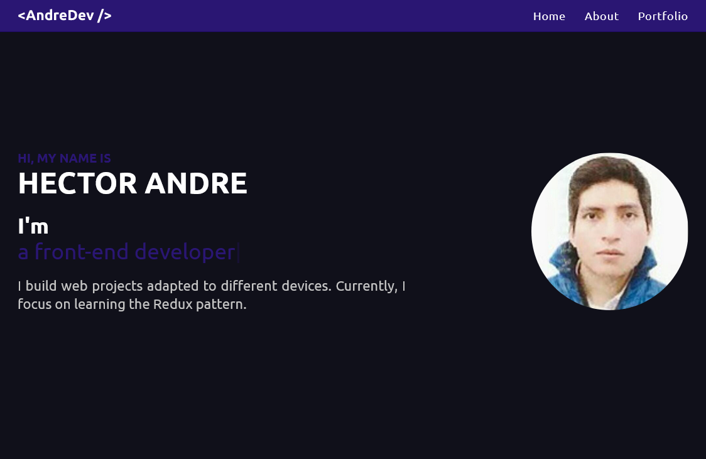

<h1 align="center">
  Portfolio website 
  <a href="https://andredev.vercel.app/" target="_blank">andredev</a>
</h1>

  

 

## Table of contents

- [Overview](#overview)
  - [Links](#links)
- [My process](#my-process)
  - [Built with](#built-with)
- [Getting Started](#getting-started)
  - [Installation and Setup Instructions](#installation-and-setup-instructions)
- [Author](#author)

## Overview

### Links

- Solution URL: [GitHub](https://github.com/AndreDev12/portfolio)
- Live Site URL: [Vercel](https://andredev.vercel.app/)

## My process

### Built with

- [Next.js](https://nextjs.org/) - React framework
- [TypeScript](https://www.typescriptlang.org/) - Programming language
- [React](https://reactjs.org/) - JS library
- [Styled-components](https://styled-components.com/) - CSS for the component
- [Typed.js](https://www.npmjs.com/package/typed.js) - JavaScript typing animation library
- [React-icons](https://www.npmjs.com/package/react-icons) - Popular icon packs

## Getting started

### Installation and Setup Instructions

1. Clone this repository: git clone https://github.com/AndreDev12/portfolio.git

2. Installation: `npm install`

3. In the project directory, you can run: `npm run dev`

Runs the app in the development mode.\
Open [http://localhost:5173](http://localhost:5173) to view it in the browser.
The page will reload if you make edits.

## Author

- LinkedIn - [Héctor André Huambachano Torres](https://www.linkedin.com/in/h%C3%A9ctor-andr%C3%A9-huambachano-torres/)
- Twitter - [@HectorAndreHT](https://twitter.com/HectorAndreHT)
